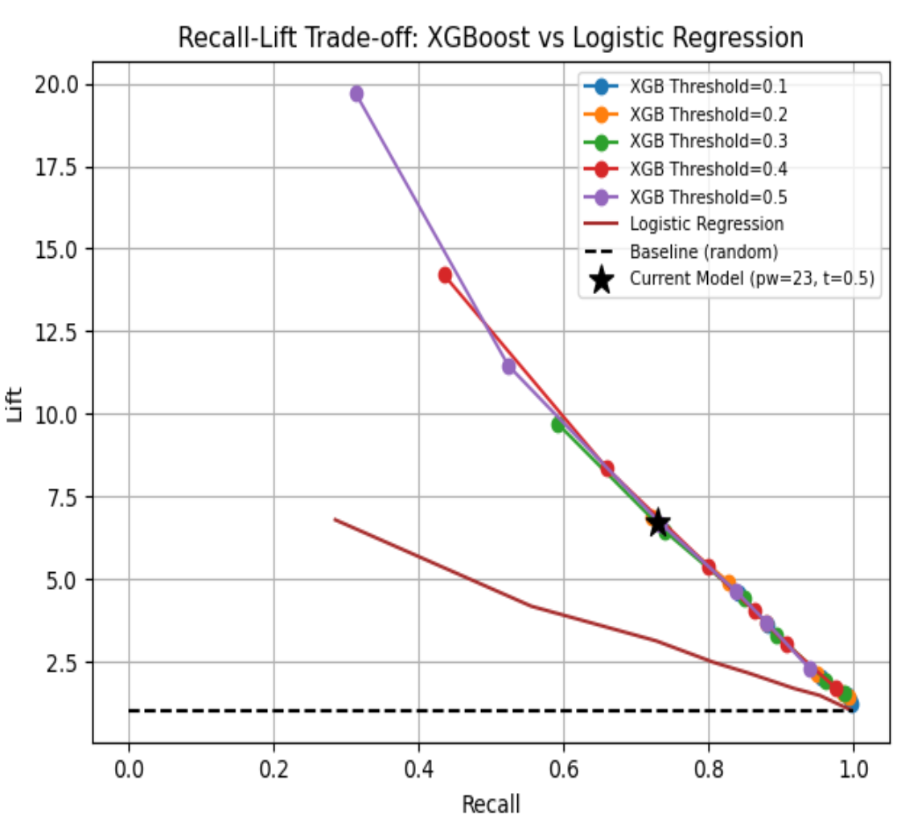

#  **Fast Fraud Screening:** _Using Lightweight Models to Flag Risk Before Deep Analysis_ 

This repository is for the Fast Fraud Screening project as part of the fulfillment of [The Erdös Institute](https://www.erdosinstitute.org/) Data Science Bootcamp for Fall 2025.

**Team members:** [Abdullah Ahmed](https://github.com/abdullah5523p), [Noimot Bakare Ayoub](https://github.com/unomics20), [Cyril Morluyan Cordor](https://github.com/cyril-cordor), [Brandon Owens](https://github.com/Brandon-Owens)

**Presentation Deliverables**
- [5-minute video presentation](presentation/Presentation.mp4)
- [Presentation slides PDF](presentation/Fraud_Detection_Erdos_FL25-Google_Slides.pdf)
- [Executive Summary](presentation/Executive_Summary-Fast_Fraud_Screening.pdf)

**Disclosure:** Documents, notebooks, code, visualizations etc. displayed in this repository include or reference data provided by J.P. Morgan Chase & Co.

# Contents

1. [Introduction](#introduction)
2. [Dataset](#dataset)
3. [Methods and Models](#methods-and-models)
4. [Results](#results)
5. [Key Performance Indicators](#key-performance-indicators-kpis)
6. [Challenges](#challenges)
7. [Files](#files)

## Introduction
Financial fraud is a growing challenge. This project proposes a two-stage fraud detection framework: a lightweight "surrogate model" screens transactions, prioritizing high recall, then flagged transactions go to intensive models/human analysts for verification. This reduces computational load, speeds detection, and focuses resources. Using J.P. Morgan Chase & Co's synthetic data, our XGBoost model achieved 7x Lift and 70% recall, flagging 1 in 4 fraud cases while incorrectly flagging less than 1% of legitimate transactions. We propose a "Lift" metric (recall and predicted positive rates) for efficiency, finding traditional metrics misleading.

## Dataset

We utilize the [J.P. Morgan Chase & Co. Payment Data for Fraud Protection](https://www.jpmorganchase.com/about/technology/research/ai/synthetic-data), a synthetic dataset generated due to privacy concerns. This subject-centric data contains over 1.49 million transactions (electronic transfers, bill payments, deposits, withdrawals) spanning approximately 50 years. Each entry details the transaction amount in U.S. dollars, involved accounts (sender, beneficiary, or both), and other identifying features.

 <b> Image source: J.P. Morgan Chase & Co. </b> 

Unfortunately, we cannot give full access to the Fraud Payment Data due to the Terms of Use agreement with J.P. Morgan Chase & Co.

## Methods and Models

### Methods

We engineer both transaction and graph-derived features to train a lightweight, high-recall fraud screening model.

To analyze the complex network of over 300,000 customer and merchant accounts, we used Python’s NetworkX package to construct a multi-directed graph. A multi-directed graph is a network structure composed of nodes, representing sender or beneficiary accounts, and the edges represent transactions. Edge direction shows fund flow – who is sending versus who is receiving the funds – and multiple edges indicate repeated transfers. Fraud often occurs in clusters of accounts cycling funds among themselves, making the graph view effective for uncovering hidden connections and identifying potential fraud rings.

<b>Figures 1,2:</b> Multi-directed graph network

### Models

Logistic Regression, XGBoost, Linear Discrimination Analysis, PCA

## Results

Initial results show strong computational performance and low false positive rate, demonstrating feasibility for real time screening. At the current decision threshold (0.5) fraud detection remains limited, resulting in a high miss rate. Future iterations will adjust model tuning, and thresholding to increase recall, the primary objective of the model, while maintaining manageable volume alert. This stage validates the model architecture and provides a foundation for a high-recall optimization in subsequent experiments.

<b>Table 1:</b> Training Accuracy for Logistic Regression (with cutoff 0.1) is 0.956

| | Precision | Recall | F1-Score |
|:-----------:|:-----------:|:-----------:|:-----------:|
| 0 (Non-Fraud) | 0.98 | 0.97 | 0.98 |
| 1 (Fraud) | 0.13 | 0.26 | 0.17 |

<b>Table 2:</b> Training accuracy for XGBoost is 0.979.

| | Precision | Recall | F1-Score |
|:-----------:|:-----------:|:-----------:|:-----------:|
| 0 (Non-Fraud) | 0.99 | 0.98 | 0.98 |
| 1 (Fraud) | 0.24 | 0.29 | 0.26 |

These results don't reflect our model's preprocessing effectiveness. We instead suggest using 'Lift,' a standard data science metric,

$$\large \text{Lift} = \dfrac{ \dfrac{\text{TP}}{\text{TP} + \text{FN}}}{\dfrac{\text{FP} + \text{TP}}{\text{FP} + \text{TP} + \text{TN} + \text{FN}}}.$$

This metric, similar to recall but with Predicted Positive Rate (PPR) in the denominator, measures efficiency. It prioritizes high fraud detection (recall) and a low PPR, aiming to minimize missed fraud and human agent workload by forwarding essential cases.

Any randomized model has Lift = 1, and Figure 3 shows how our models have the flexibility to trade Recall for Lift. For instance, with recall reduced to 73%, our XGBoost model boasts 7x the Lift of the baseline. This significantly boosts fraud detection efficiency and dramatically cuts operational costs.

<b>Figure 3:</b> Lift vs. Recall

## Key Performance Indicators (KPIs)

### Model Performance KPIs

Our KPIs include the percentage of fraud transactions correctly flagged (Recall), and a measure of how much better the model is at identifying fraud compared to random guessing (Lift). We examined the trade-offs between recall and lift for our XGBoost model across different thresholds. Relative to monetary net benefit, the optimal threshold is 0.36, where the model achieves 83% recall, balancing detection coverage and precision.

### Business KPIs

We use synthetic data to create realistic fraud risk KPIs, evaluating the model on false positives, analyst workload savings, simulated loss-avoidance scores, total loss avoided (USD), and total review cost.

<b>Table 3:</b> Optimal Business KPIs

| Metric | Result | Interpretation |
|:-----------:|:-----------:|:-----------:|
| Fraud Detection Recall | 83% | % of fraud successfully flagged |
| False Negative Rate | 17% | % of fraud missed |
| False Positive Rate | 16% | % of legitimate transactions flagged |
| Synthetic Loss Avoided | $3.8M | Proxy dollars saved by catching fraud |
| Total Review Cost | $0.53M | Cost of analyst reviewing alerts |
| Missed Fraud Risk | $0.47M | Proxy dollars lost from missed fraud |

*Key takeaways:*

* Our lightweight model offers high speed and low-computational overhead suitable for real-time deployment.
* At the threshold of 0.36, the model:
  - delivers $3.32 million in net benefit, which is $2.16 million better than operatoring without a filter[^1];
  - flags 83% of fraud cases, catching $3.8 million in fraudulent transactions before they occur[^1].
* Adjustments in the model can be readily made to align with bank fraud pre-screening strategies.

<b>Table 4:</b> Business KPIs over various XGBoost models

| Threshold | Recall | Lift | % Flagged | Loss Avoided | Net Benefit |
|:-----------:|:-----------:|:-----------:|:-----------:|:-----------:|:-----------:|
| 0.00 | 100.0% | 1.00x | 100.0% | $4.27M | $1.17M |
| 0.16 | 90.6% | 3.22x | 28.2% | $4.05M | $3.18M |
| 0.20 | 88.4% | 3.68 | 24.0% | $3.98M | $3.23M |
| **0.36** | **83.3%** | **4.84x** | **17.2%** | **$3.86M** | **$3.32M** |
| 0.40 | 81.2% | 5.23x | 15.5% | $3.80M | $3.31M |
| 0.50 | 74.5% | 6.51x | 11.4% | $3.62M | $3.26M |
| 0.70 | 50.4% | 11.64x | 4.3% | $2.99M | $2.86M |

[^1]: Note: Synthetic values approximate business value since the data set is synthetic. A back of envelope calculation assumes an analyst makes $50/hour taking 15 minutes per case review, and an initial triage cost of $12.50.

## Challenges

Developing a fraud detection model using the J.P. Morgan dataset presents three main challenges:

1. **Feature Engineering:** New features must be generated from raw transaction data to uncover fraudulent patterns.

2. **Imbalanced Data:** Fraudulent transactions (2.06% of 1.49 million+) are significantly outnumbered by non-fraudulent ones, making it difficult for a model to learn (Figures 4, 5).

3. **Synthetic Data Artifact:** Transaction timestamps in this synthetic dataset may follow a pattern, potentially lacking predictive information about fraud, as fraudulent labels were assigned using predefined probabilities.

4. **Normal metrics like accuracy and PR-AUC do not reflect the performance** of our filter well. Instead we use 'Lift,' a standard data science metric that measures efficiency and is defined as follows:

 <b> Figures 4,5:</b> Number of fraudulent transaction types vs. all transactions

## Files

### Notebooks and Scripts

- [`requirements.txt`](requirements.txt): Python package requirements to run Jupyter notebooks
- [`Fast_Fraud_Screening_Driver_ntbk.py`](notebooks/Fast_Fraud_Screening_Driver_ntbk.py): This script runs Jupyter notebooks for `Model.ipynb`, `Fast_Fraud_Screening_Business_KPIs.ipynb`, and `Fast_Fraud_Screening_Report_Visualisations.ipynb` programmatically using `nbclient`. Each notebook will execute cell by cell — exactly as if you ran it manually in Jupyter. This notebook will print errors from any notebook however, it will not stop the next notebook from running.
- [`Model.ipynb`](notebooks/Model.ipynb): Contains the code generating the multi-directed graph as well as the different models, Logistic Regression and XGBoost
- [`Fast_Fraud_Screening_Report_Visualization.ipynb`](notebooks/Fast_Fraud_Screening_Report_Visualization.ipynb): Code for generating data visualizations present in the presentation and readme files
- [`Fast_Fraud_Screening_Business_KPIs.ipynb`](notebooks/Fast_Fraud_Screening_Business_KPIs.ipynb): Code for generating statistics and plots on Business KPIs

### Visualizations

- [`synthetic-payment-data-sample.png`](visualization_files/synthetic-payment-data-sample.png): sample image of J.P. Morgan Fraud Data
- [`network_example.png`](visualization_files/network_example.png): example of a small subset of the graph network
- [`network_example_w_fraud_ring.png`](visualization_files/network_example_w_fraud_ring.png): example of a small subset of the graph network featuring nodes/accounts with fraudulent actors
- [`regressions_lift_vs_recall.png`](visualization_files/regressions_lift_vs_recall.png): lift vs. recall plot
- [`fraud_and_non-fraud_vs_transaction_types.png`](visualization_files/fraud_and_non-fraud_vs_transaction_types.png): bar graph of number of fraudulent and non-fraudulent transactions per type
- [`fraud_number_vs_transaction_types.png`](visualization_files/fraud_number_vs_transaction_types.png): bar graph of just fraudulent transactions per type
- [`model_perf_on_fraud_losses.png`](visualization_files/model_perf_on_fraud_losses.png): bar graph of model performance on estimated fraud losses
